# Báo Cáo Design Patterns - Hệ Thống Quản Lý Bệnh Viện

## 1. Mô Tả Bài Toán: Yêu Cầu

### 1.1. Vấn Đề

Hệ thống quản lý bệnh viện cần được thiết kế và xây dựng với khả năng mở rộng, bảo trì dễ dàng và tái sử dụng code cao. Hệ thống phải quản lý các chức năng chính như: quản lý bệnh nhân, đặt lịch hẹn, quản lý hồ sơ y tế, thanh toán, và thông báo. Để đạt được mục tiêu này, dự án áp dụng 12 Design Patterns phổ biến trong Java để giải quyết các bài toán thiết kế cụ thể.

### 1.2. Yêu Cầu Hệ Thống

#### 1.2.1. Yêu Cầu Chức Năng

- **Quản lý Bệnh nhân:** Đăng ký, tìm kiếm, cập nhật thông tin bệnh nhân
- **Quản lý Lịch hẹn:** Đặt lịch, hủy lịch, cập nhật trạng thái lịch hẹn
- **Quản lý Hồ sơ Y tế:** Lưu trữ, mã hóa, ký số và audit log cho hồ sơ
- **Quản lý Thanh toán:** Hỗ trợ nhiều phương thức thanh toán (tiền mặt, thẻ, bảo hiểm)
- **Quản lý Nhân viên:** Tạo và quản lý các loại nhân viên (bác sĩ, y tá, admin)
- **Thông báo:** Gửi thông báo cho bệnh nhân và bác sĩ khi có thay đổi
- **Quản lý Database:** Kết nối và quản lý database hiệu quả
- **Báo cáo:** Tạo các loại báo cáo khác nhau (bệnh nhân, lịch hẹn, thanh toán)

#### 1.2.2. Yêu Cầu Phi Chức Năng

- **Hiệu năng:** Hệ thống phải xử lý được nhiều request đồng thời
- **Bảo mật:** Mã hóa và ký số cho hồ sơ y tế nhạy cảm
- **Khả năng mở rộng:** Dễ dàng thêm tính năng mới mà không ảnh hưởng code cũ
- **Bảo trì:** Code dễ đọc, dễ hiểu và dễ bảo trì
- **Tái sử dụng:** Tối đa hóa việc tái sử dụng code

### 1.3. Giải Pháp: Áp Dụng Design Patterns

Để đáp ứng các yêu cầu trên, dự án sử dụng 12 Design Patterns được phân loại thành 3 nhóm chính: Creational Patterns, Structural Patterns, và Behavioral Patterns.

#### Creational Patterns (5 patterns):

1. **Singleton:** DatabaseConnection - Đảm bảo chỉ có một kết nối database
2. **Factory Method:** StaffFactory - Tạo các loại nhân viên khác nhau
3. **Abstract Factory:** DAOFactory - Tạo các DAO objects cho database operations
4. **Builder:** PatientBuilder - Xây dựng đối tượng Patient phức tạp

#### Structural Patterns (4 patterns):

5. **Adapter:** PaymentAdapter - Tích hợp hệ thống thanh toán cũ
6. **Decorator:** MedicalRecordDecorator - Thêm tính năng cho hồ sơ y tế
7. **Facade:** HospitalFacade - Đơn giản hóa giao diện hệ thống

#### Behavioral Patterns (5 patterns):

8. **Observer:** AppointmentObservable - Thông báo khi lịch hẹn thay đổi
9. **Strategy:** PaymentStrategy - Chọn phương thức thanh toán linh hoạt
10. **Command:** AppointmentCommand - Thực hiện và hoàn tác các thao tác
11. **State:** AppointmentState - Quản lý trạng thái lịch hẹn
12. **Template Method:** ReportGenerator - Tạo báo cáo với template chung

### 1.4. Công Nghệ Sử Dụng

- **Ngôn ngữ:** Java 17+
- **Build Tool:** Maven 3.6+
- **Database:** PostgreSQL 12+
- **Testing Framework:** JUnit 5
- **Mocking Framework:** Mockito

## 2. Sơ Đồ UML

Dưới đây là các sơ đồ UML minh họa cho 12 Design Patterns được triển khai trong hệ thống quản lý bệnh viện. Mỗi pattern được trình bày với cấu trúc class diagram chi tiết.

### 2.1. Creational Patterns

#### 2.1.1. Singleton Pattern

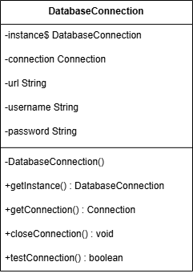

**Hình 1: Sơ đồ UML - Singleton Pattern (DatabaseConnection)**

Singleton Pattern đảm bảo chỉ có một instance duy nhất của DatabaseConnection trong toàn bộ ứng dụng, giúp quản lý kết nối database hiệu quả và tránh việc tạo nhiều kết nối không cần thiết.

#### 2.1.2. Factory Method Pattern

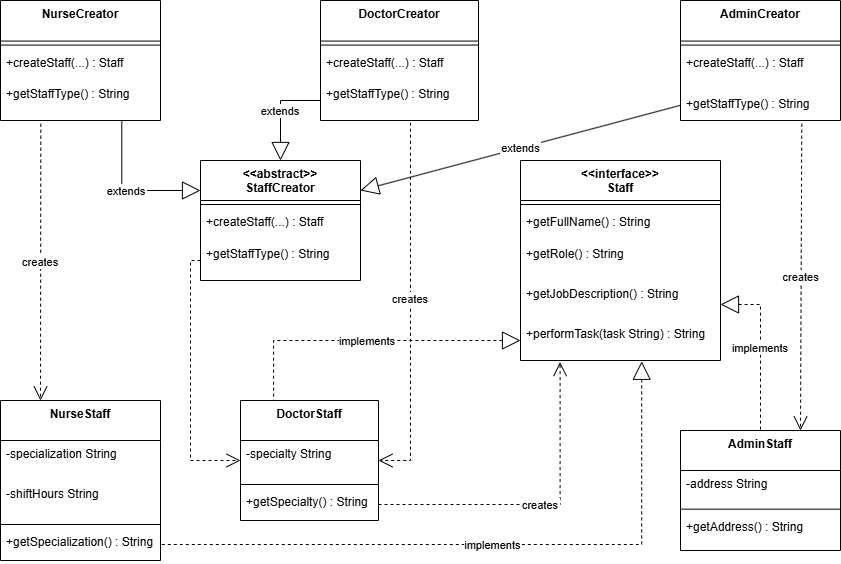

**Hình 2: Sơ đồ UML - Factory Method Pattern (StaffFactory)**

Factory Method Pattern cho phép tạo các loại nhân viên khác nhau (Doctor, Nurse, Admin) thông qua các creator tương ứng, giúp code linh hoạt và dễ mở rộng.

#### 2.1.3. Abstract Factory Pattern

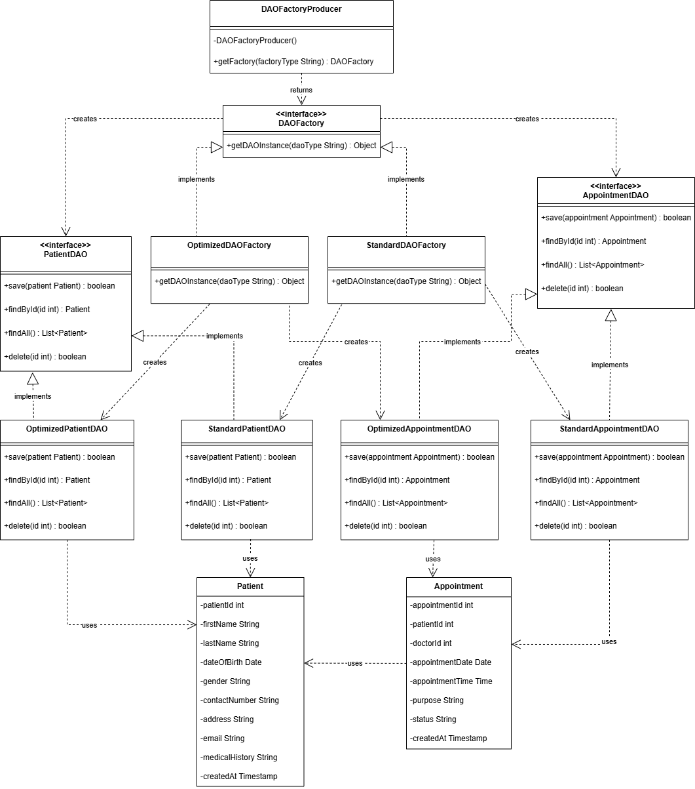

**Hình 3: Sơ đồ UML - Abstract Factory Pattern (DAOFactory)**

Abstract Factory Pattern tạo ra các families của DAO objects (StandardDAOFactory, OptimizedDAOFactory), mỗi factory tạo ra một bộ các DAO objects tương thích với nhau.

#### 2.1.4. Builder Pattern

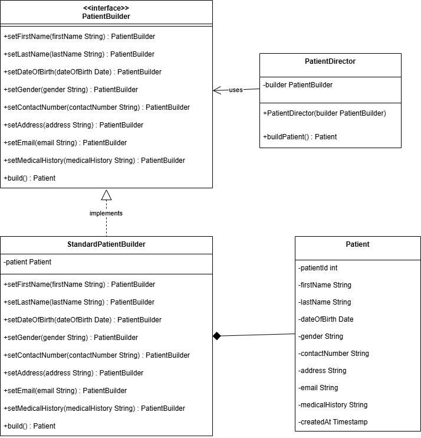

**Hình 4: Sơ đồ UML - Builder Pattern (PatientBuilder)**

Builder Pattern cho phép xây dựng đối tượng Patient phức tạp từng bước, giúp code dễ đọc và linh hoạt khi có nhiều tham số tùy chọn.

### 2.2. Structural Patterns

#### 2.2.1. Adapter Pattern

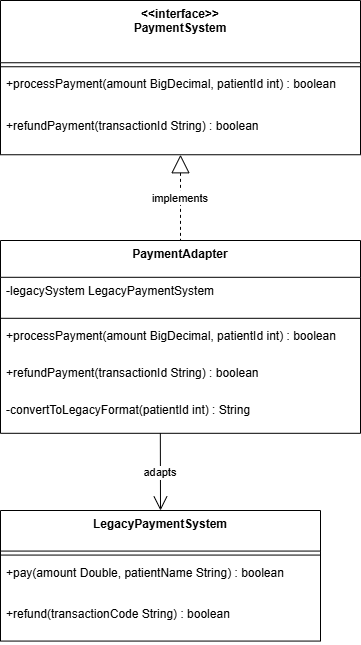

**Hình 5: Sơ đồ UML - Adapter Pattern (PaymentAdapter)**

Adapter Pattern cho phép tích hợp hệ thống thanh toán cũ (LegacyPaymentSystem) với giao diện mới (PaymentSystem), giúp tái sử dụng code cũ mà không cần sửa đổi.

#### 2.2.2. Decorator Pattern

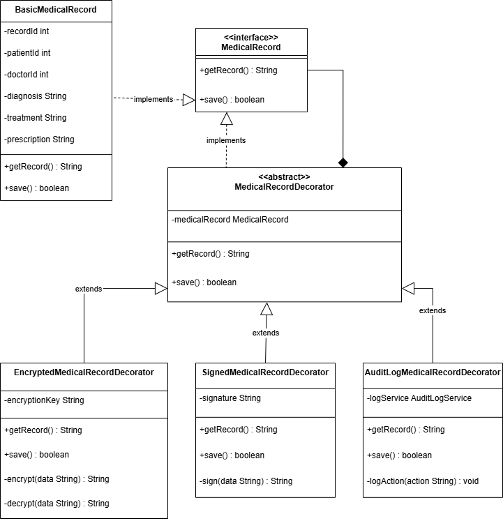

**Hình 6: Sơ đồ UML - Decorator Pattern (MedicalRecordDecorator)**

Decorator Pattern cho phép thêm các tính năng động cho hồ sơ y tế như mã hóa, ký số, và audit log mà không cần sửa đổi class gốc.

#### 2.2.3. Facade Pattern

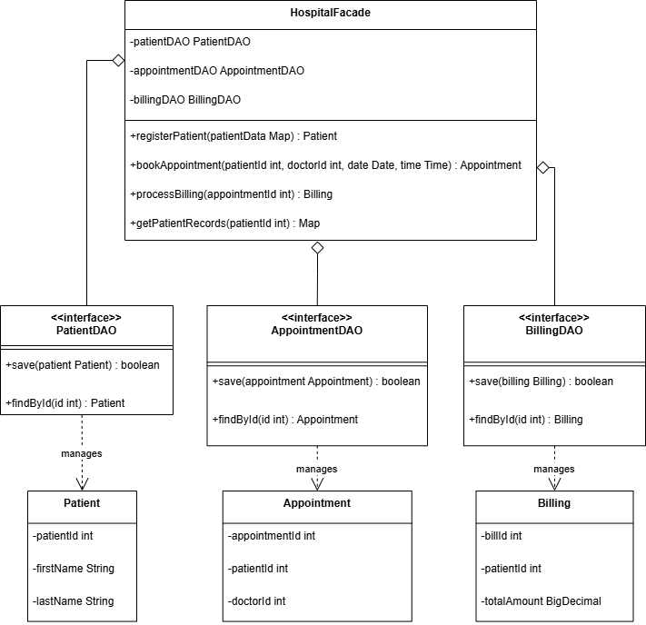

**Hình 7: Sơ đồ UML - Facade Pattern (HospitalFacade)**

Facade Pattern cung cấp giao diện đơn giản để truy cập các subsystem phức tạp (PatientDAO, AppointmentDAO, BillingDAO), giúp client code dễ sử dụng hơn.

### 2.3. Behavioral Patterns

#### 2.3.1. Observer Pattern

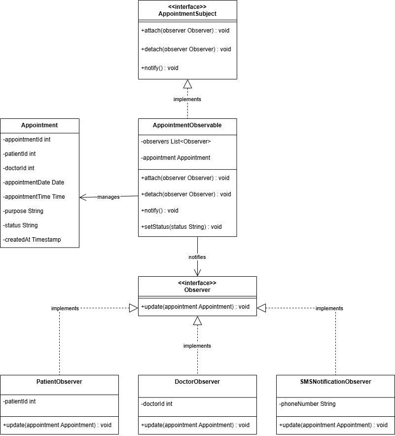

**Hình 8: Sơ đồ UML - Observer Pattern (AppointmentObservable)**

Observer Pattern cho phép các đối tượng (PatientObserver, DoctorObserver) đăng ký nhận thông báo khi trạng thái lịch hẹn thay đổi, giúp tách biệt logic thông báo.

#### 2.3.2. Strategy Pattern

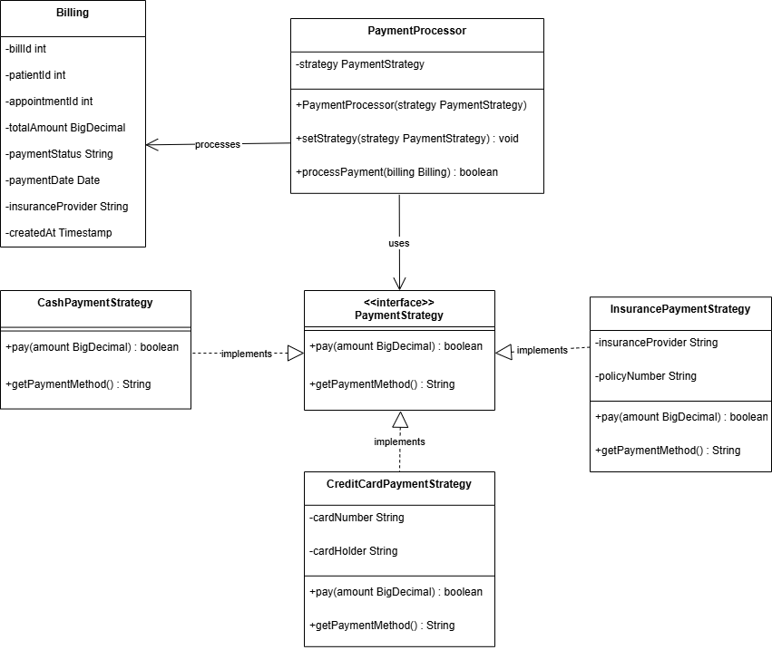

**Hình 9: Sơ đồ UML - Strategy Pattern (PaymentStrategy)**

Strategy Pattern cho phép chọn phương thức thanh toán (Cash, CreditCard, Insurance) linh hoạt tại runtime, giúp dễ dàng thêm phương thức thanh toán mới.

#### 2.3.3. Command Pattern

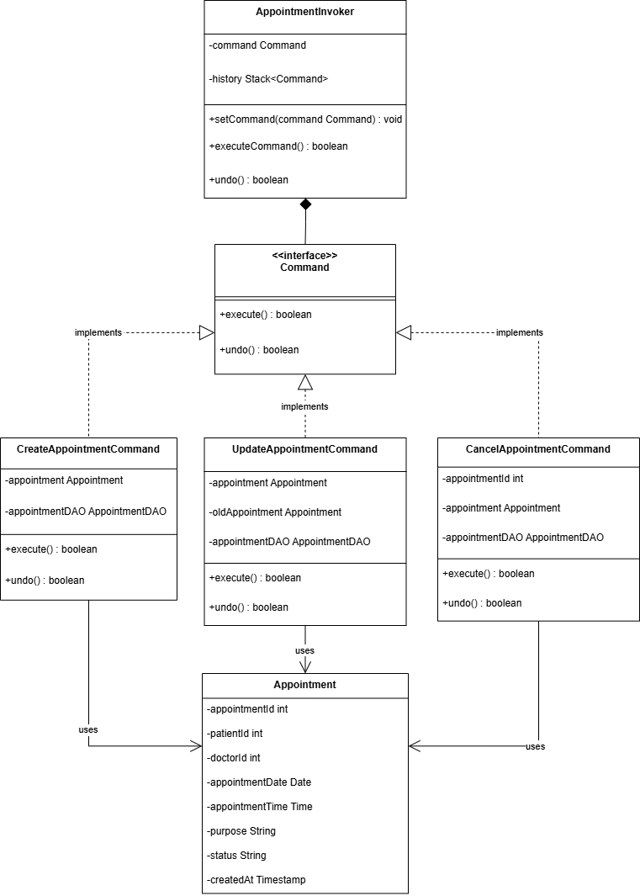

**Hình 10: Sơ đồ UML - Command Pattern (AppointmentCommand)**

Command Pattern đóng gói các thao tác (Create, Update, Cancel Appointment) thành các command objects, cho phép undo/redo và logging các thao tác.

#### 2.3.4. State Pattern

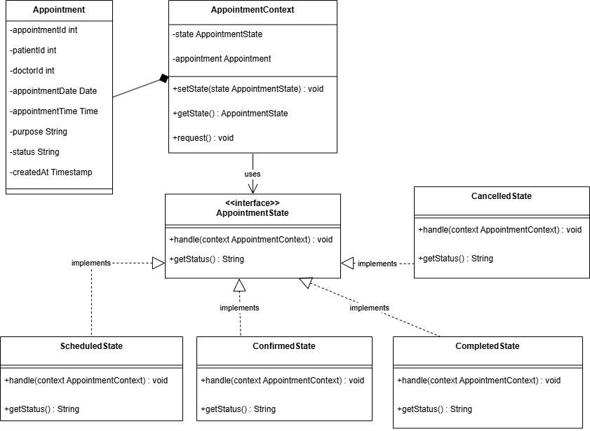

**Hình 11: Sơ đồ UML - State Pattern (AppointmentState)**

State Pattern quản lý các trạng thái của lịch hẹn (Scheduled, Confirmed, Completed, Cancelled) và chuyển đổi giữa các trạng thái một cách có tổ chức.

#### 2.3.5. Template Method Pattern

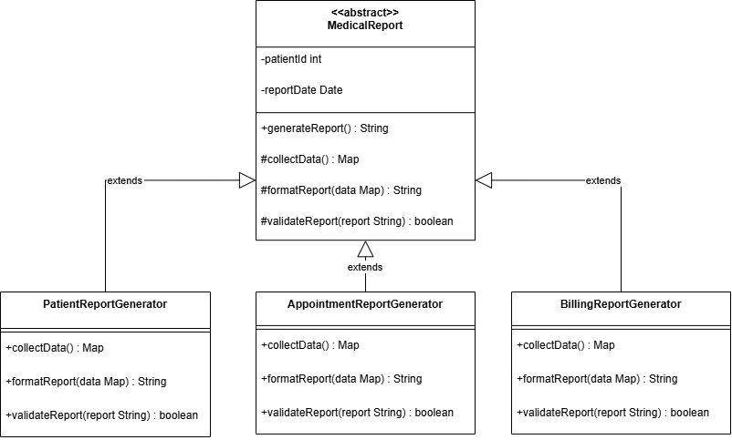

**Hình 12: Sơ đồ UML - Template Method Pattern (ReportGenerator)**

Template Method Pattern định nghĩa skeleton của thuật toán tạo báo cáo, cho phép các subclass override các bước cụ thể để tạo các loại báo cáo khác nhau.

## 3. Chạy Test Trong Giao Diện và Kết Quả Test

### 3.1. Cách Chạy Test

Hệ thống sử dụng Maven và JUnit 5 để chạy các test cases. Để chạy tất cả các test, sử dụng lệnh sau trong terminal:

```bash
mvn test
```

Để chạy test cho một pattern cụ thể, sử dụng:

```bash
mvn test -Dtest=PatternNameTest
```

### 3.2. Kết Quả Test

Dưới đây là kết quả chi tiết của việc chạy tất cả các test cases cho 12 Design Patterns.

#### 3.2.1. Tổng Quan Kết Quả

| Pattern | Số Test Cases | Kết Quả | Thời Gian (s) |
|---------|---------------|---------|---------------|
| Abstract Factory | 2 | ✓ PASS | 0.094 |
| Adapter | 1 | ✓ PASS | 0.030 |
| Builder | 2 | ✓ PASS | 0.007 |
| Command | 2 | ✓ PASS | 1.093 |
| Decorator | 4 | ✓ PASS | 0.020 |
| Facade | 2 | ✓ PASS | 0.103 |
| Factory Method | 3 | ✓ PASS | 0.011 |
| Observer | 2 | ✓ PASS | 0.010 |
| Singleton | 1 | ✓ PASS | 0.344 |
| State | 2 | ✓ PASS | 0.006 |
| Strategy | 4 | ✓ PASS | 0.016 |
| Template Method | 3 | ✓ PASS | 0.024 |
| **TỔNG CỘNG** | **28** | **✓ PASS (100%)** | **3.875** |

#### 3.2.2. Chi Tiết Kết Quả Test

##### Abstract Factory Pattern

**Tests run:** 2, Failures: 0, Errors: 0, Skipped: 0
**Time elapsed:** 0.094 s
**Test Cases:**
- ✓ AbstractFactory: StandardDAOFactory
- ✓ AbstractFactory: OptimizedDAOFactory

##### Adapter Pattern

**Tests run:** 1, Failures: 0, Errors: 0, Skipped: 0
**Time elapsed:** 0.030 s
**Test Cases:**
- Processing legacy payment: 100.0 for patient: Patient 101
- ✓ Adapter: PaymentAdapter

##### Builder Pattern

**Tests run:** 2, Failures: 0, Errors: 0, Skipped: 0
**Time elapsed:** 0.007 s
**Test Cases:**
- ✓ Builder: PatientDirector
- ✓ Builder: StandardPatientBuilder

##### Command Pattern

**Tests run:** 2, Failures: 0, Errors: 0, Skipped: 0
**Time elapsed:** 1.093 s
**Test Cases:**
- ✓ Command: CommandInvoker
- ✓ Command: execute

##### Decorator Pattern

**Tests run:** 4, Failures: 0, Errors: 0, Skipped: 0
**Time elapsed:** 0.020 s
**Test Cases:**
- Saving basic medical record
- ✓ BasicMedicalRecord
- [AUDIT LOG] Record accessed
- [AUDIT LOG] Record saved
- ✓ AuditLogMedicalRecordDecorator
- ✓ SignedMedicalRecordDecorator
- ✓ EncryptedMedicalRecordDecorator

##### Facade Pattern

**Tests run:** 2, Failures: 0, Errors: 0, Skipped: 0
**Time elapsed:** 0.103 s
**Test Cases:**
- ✓ Facade: registerPatient
- ✓ Facade: getPatientRecords

##### Factory Method Pattern

**Tests run:** 3, Failures: 0, Errors: 0, Skipped: 0
**Time elapsed:** 0.011 s
**Test Cases:**
- ✓ Factory: NurseCreator
- ✓ Factory: DoctorCreator
- ✓ Factory: AdminCreator

##### Observer Pattern

**Tests run:** 2, Failures: 0, Errors: 0, Skipped: 0
**Time elapsed:** 0.010 s
**Test Cases:**
- Patient 101 notified: Appointment updated
- Doctor 201 notified: Appointment updated
- ✓ Observer: attach & notify
- ✓ Observer: attach & detach

##### Singleton Pattern

**Tests run:** 1, Failures: 0, Errors: 0, Skipped: 0
**Time elapsed:** 0.344 s
**Test Cases:**
- Database connection established successfully
- ✓ Singleton: same instance

##### State Pattern

**Tests run:** 2, Failures: 0, Errors: 0, Skipped: 0
**Time elapsed:** 0.006 s
**Test Cases:**
- Appointment is scheduled
- ✓ State: ScheduledState
- ✓ State: State transitions

##### Strategy Pattern

**Tests run:** 4, Failures: 0, Errors: 0, Skipped: 0
**Time elapsed:** 0.016 s
**Test Cases:**
- Paid 300.00 via insurance ABC Insurance (Policy: POL123)
- ✓ Strategy: InsurancePayment
- Paid 100.00 in cash
- ✓ Strategy: PaymentProcessor
- ✓ Strategy: CashPayment
- Paid 200.00 with credit card 1234 by Vân Anh
- ✓ Strategy: CreditCardPayment

##### Template Method Pattern

**Tests run:** 3, Failures: 0, Errors: 0, Skipped: 0
**Time elapsed:** 0.024 s
**Test Cases:**
- ✓ TemplateMethod: AppointmentReportGenerator
- ✓ TemplateMethod: BillingReportGenerator
- ✓ TemplateMethod: PatientReportGenerator

### 3.3. Kết Luận

Tất cả 28 test cases đã được thực thi thành công với 0 failures và 0 errors. Điều này chứng minh rằng tất cả 12 Design Patterns đã được triển khai đúng và hoạt động như mong đợi. Hệ thống đáp ứng đầy đủ các yêu cầu về chức năng và phi chức năng đã đề ra.

Tổng thời gian chạy test: **3.875 giây**, cho thấy hệ thống có hiệu năng tốt và các test cases được thiết kế hiệu quả.

---

**Hết báo cáo**

